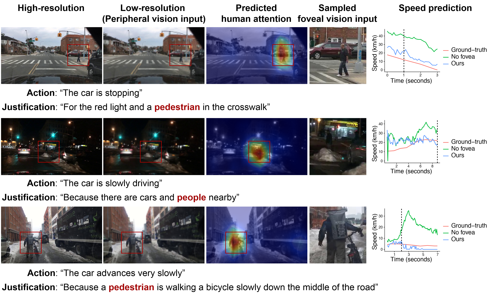
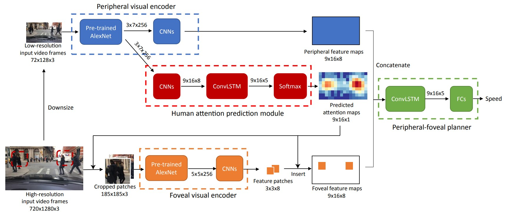

# Periphery-Fovea Multi-Resolution Driving Model Guided by Human Attention

## Project Introduction:

This project accompanies the paper **_Periphery-Fovea Multi-Resolution Driving Model Guided by Human Attention_** (https://arxiv.org/abs/1903.09950)

## Demo:


### Video demos 
<a href="http://www.youtube.com/watch?feature=player_embedded&v=VWa4qm5o17E" target="_blank">
     
</a>

### Model structure


## Using Our Code:
### Dependencies
The code was written with Tensorflow 1.5, a customized version of Keras 2.1.5 and some other common packages. A Docker image [blindgrandpa/periphery_fovea_driving_model](https://hub.docker.com/repository/docker/blindgrandpa/periphery_fovea_driving_model) was prepared for running the code. The Dockerfile of that Docker image is at `./docker_images/periphery_fovea_driving_model/` in this repo. The Dockerfile lists all the dependencies. In order to use this Docker image to run our code, you need to have nvidia-docker installed.


### Train our model from scratch with Berkeley DeepDrive Video Dataset (BDD-V)
1. Please visit this GitHub [repo](https://github.com/pascalxia/BDD_Driving_Model-1) and follow the instructions there to prepare the data in BDD-V for our model. 

2. Download the pre-trained attention prediction model and driving model. Download [this zip file](https://drive.google.com/file/d/1U2gsupZbK0UqOC8gPX_Mp3F719xNi633/view?usp=sharing) and unzip it to `./`. After unzip, you should see `./attention_prediction_model_checkpoints` and `./logs/pre-trained_model`.

3. Download the pre-trained weights of Alexnet. Downlaod [bvlc_alexnet.npy](https://www.cs.toronto.edu/~guerzhoy/tf_alexnet/bvlc_alexnet.npy) and put it at `./`.

4. Start training by running the following command. Replace `a_name_for_this_experiment` with another folder name you like.
```bash
python3 train.py \
--data_dir=data \
--model_dir=logs/a_name_for_this_experiment \
--use_foveal=True \
--attention_model_dir=attention_prediction_model_checkpoints/pre-trained \
--sample_fovea=True \
--attention_logit_factor=1 \
--batch_size=3 \
--n_steps=20 \
--validation_batch_size=3 \
--validation_n_steps=20 \
--train_epochs=220 \
--epochs_before_validation=1 \
--feature_map_channels=256 \
--quick_summary_period=120 \
--slow_summary_period=1200 \
--augment_data=False \
--small_camera_size 72 128 \
--camera_size 720 1280 \
--gazemap_size 9 16 \
--n_future_steps=10
```

5. To track the training in Tensorboard, run the following command.
```bash
tensorboard --logdir=logs/a_name_for_this_experiment
```


### Evaluate our pre-trained model or your trained models
1. The original videos of BDD-V dataset are about one-minute long. Your machine may not be able to fit one whole video in. Run the following command to divide the testing videos into segments of a length of your choice. Note that the unit of `--max_length` is the number of frames. In this example command, `--max_length` is set to 310. This is because the frame rate is 10Hz, the model predicts for one second in the future and we would like to test the model over 30-second-long sequences.
```bash
python3 divide_tfrecords.py \
--data_dir=data \
--visible_gpus=0 \
--max_length=310
```

2. Run the following command to evaluate a model. Replace `a_name_for_this_experiment` with the folder name that you set in training, or replace it with `pre-trianed_model` to test our pre-trained model. If you did not divide the test videos into short segments, set `--multiple_tfrecords=False`. The program will create two Pandas data frames, `outputs.feather` and `videos.feather` in the folder `./logs/a_name_for_this_experiment/prediction_iter_*`. The data frame `outputs.feather` records the predicted speed and prediction error at each frame and `videos.feather` records the videos used and their keys.
```bash
python3 predict_and_evaluate.py \
--data_dir=data \
--model_dir=logs/a_name_for_this_experiment \
--use_foveal=True \
--attention_model_dir=attention_prediction_model_checkpoints/pre-trained \
--sample_fovea=True \
--attention_logit_factor=1 \
--batch_size=1 \
--feature_map_channels=256 \
--small_camera_size 72 128 \
--camera_size 720 1280 \
--n_future_steps=10 \
--multiple_tfrecords=True
```